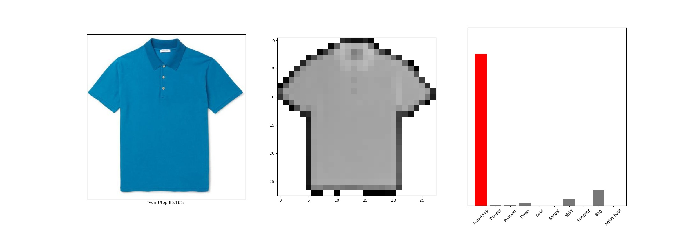

# Introduction

This project is a lab about **BigData Virtualization** and **Learning**, using the tech of **Containerization**. The lab build a simple web app based on the framework of python & flask & cassandra, which realizes the classification of images of clothing. Then it build the app into a container by means of [docker](https://www.docker.com/).  
  
The project was done by Gao Hanyuan under the guidance of [Fan Zhang](http://www.mit.edu/~f_zhang/)!

---

## App: Classification
We borrow datas and algorithm from [tensorflow](https://tensorflow.google.cn/) to trains a neural network model to classify images of clothing, details showed in the tutorial of [tensorflow.keras](https://tensorflow.google.cn/tutorials/keras/classification) or in `model.py`. Here is an example of the result:

The `model.py` use the APIs and datas (the Fashion MINIST dataset), from tensorflow.keras. It create, build and train a network, then save the final model into `my_model.h5`.

## Web API
We use [flask](https://flask.palletsprojects.com/en/1.1.x/) as our Web application framework, details in `app.py`. The structure is like this(see in [quickstart](https://flask.palletsprojects.com/en/1.1.x/quickstart/)):  
```python
from flask import Flask
app = Flask(__name__)

@app.route('/')
def hello_world():
    return 'Hello, World!'
```
We load our model above and use it to do prediction. The app recieve a file of image from the Web font end. As an example:  
  

In the back end, we use our app to make prediction and return the visualized result.
  


## Database
We choose [cassandra](https://cassandra.apache.org/) as our database, for its light weight and good distributability. More convevnient, cassandra has been pakaged into [cassandra-docker](https://hub.docker.com/_/cassandra/). Get and run it with few commands.

```
docker pull cassandra
docker run --name some-cassandra --network some-network -d cassandra:tag
docker run -it --network some-network --rm cassandra cqlsh some-cassandra
```
There is also some useful tools like cassandra workbench to help operate on cassandra. VS code has a plugin tool:  
  


Python acts well to connect with cassandra by import the model [cassandra-driver](https://docs.datastax.com/en/developer/python-driver/3.22/).  
  
 `DB.py` shows how to connect to a database and run several cql queries. Be careful about the address and port map of your server, which is the key to successful connection. In windows, docker run in a virtual machine, thus the IP address should be the IP of the machine, not the address of Host.  
 
 `app.py` contains how the app connect and insert datas to an existing database.

 The app inserts time, filename and the result into the database. We can inspect the result by cql query in cqlsh runned in docker.
 ```SQL
 select * from Table
 ```
Or in workbench  
  


## Build and run an image in docker
At this part, we pakage our app into an image and run a container in docker. Since we have already run the database server in docker, there will be two containers communicating with each other in the end. Docker has a tutorial of [build and run your own image](https://docs.docker.com/get-started/part2/).  
  
The issue is about writing `dockerfile`
```dockerfile
# bulid an image based on an basic image
FROM python:3.7
  
# set the workplace
WORKDIR /app
  
# copy files
ADD . /app
  
# install dependencies
RUN pip install -r requirements.txt

EXPOSE 5000

# Run app.py when the container launches
CMD ["export", "FLASK_APP=hello.py"]
CMD ["flask", "run"]
```
Use docker command to bulid and run your images. Docker will run the instructions in dockerfile one by one and build an image. 
```
docker build -t bdroject:latest .
```
Notice that `requirement.txt` contains all dependencies of python models. This file can be easily build by running a pip cmd
in the virtual envirnment of your project:
```sh
pip freezing>requirements.txt
```
Then launch a container of an image. The CMD part of dockerfile will be carried out at this moment. We need to run our flask app, thus two cmd are executed.
```sh
export FLASK_APP=hello.py
flask run
```
